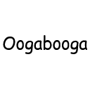

<div align="center">



# Oogabooga: The Terminator

*An unstoppable hunter stalks your every move. Your only salvation: slay the Ender Dragon.*


[](https://modrinth.com/mod/fabric-api)

[](https://modrinth.com/)

</div>

---

## Overview

Oogabooga is a [Fabric](https://fabricmc.net/) mod for **Minecraft 26.1** (Java Edition). It drops a relentless, Herobrine-skinned hunter into your world: a bot called **Oogaboooga** that pathfinds across terrain, sprint-jumps gaps, pillars up to reach you, and digs through walls when it has to. It does not give up, and almost nothing can hurt it.

The concept is a one-sided manhunt. A single hunter spawns into the server and treats the nearest player as prey, closing distance with purpose-built movement AI rather than vanilla mob navigation. The fantasy: you cannot outrun it and you cannot kill it by conventional means. The intended escape is to beat the game itself by slaying the Ender Dragon.

Under the hood the hunter is **not** a normal mob. It is a server-side fake player (`ServerPlayer`) wearing a custom skin, which lets it move, sprint, jump, and place blocks exactly like a human opponent would.

Today the hunt is started and stopped by operator commands (see [Commands](#commands)). The automatic "stop the moment the Ender Dragon dies" behavior is the design goal and is tracked on the [Roadmap](#roadmap).

## Features

- **Custom A\* pathfinding.** A purpose-built search engine plans routes over walking, stepping up, falling, swimming, and jumping, with a cost model that prefers sane paths and avoids hazards (lava, fire, cactus, magma, powder snow, and similar).
- **Relentless pursuit.** The bot re-acquires the nearest living player every tick and recomputes its path as the target moves or when it gets stuck.
- **Always sprinting.** It hunts at a sprint, with smoothed steering so it tracks you without twitching side to side.
- **Terrain-aware sprint-jump momentum.** On open, flat runways it bunny-hops to cover ground faster, and suppresses that on gaps, in water, or under low ceilings.
- **Parkour gap-jumps.** It launches across 2 to 4 block gaps, timing the takeoff at the block edge.
- **Pillar and bridge to reach you.** If you climb somewhere it cannot path to, it stacks cobblestone beneath itself to pillar up, then bridges across toward you.
- **Reactive digging.** Breaking blocks is a last resort: only when genuinely stuck and only after auto-jump has been given a chance, one block at a time, head before feet.
- **Vanilla-quality swimming.** Water movement is delegated to vanilla physics, including buoyancy, dive alignment, and auto-hopping out onto adjacent land.
- **Near-invincible.** Only a direct melee hit from a player deals damage. Fall damage, the void, fire, lava, mobs, and projectiles are all ignored. (Lava still lights it on fire cosmetically; it just does not care.)
- **Custom hunter skin.** A client-side mixin swaps the bot's appearance to a Herobrine skin so it reads instantly as a threat.

## Gallery

<!-- TODO: add hunting GIF at docs/images/hunt.gif -->


<!-- TODO: add pillar/bridge GIF at docs/images/stack-up.gif -->


<!-- TODO: add parkour GIF at docs/images/parkour.gif -->


## Commands

All commands are rooted at `/terminator` and require operator (gamemaster) permission.

| Command | Effect |
|---|---|
| `/terminator connect` | Spawns the hunter at your position. Fails if one is already connected. |
| `/terminator disconnect` | Removes the active hunter from the world. |
| `/terminator commence` | Begins the hunt: the bot starts pathfinding and chasing the nearest player. |
| `/terminator stop` | Freezes the hunter in place without removing it. |

Typical flow: `/terminator connect` to bring it in, `/terminator commence` to set it loose, `/terminator stop` to call it off, `/terminator disconnect` to send it away.

## Requirements

| Dependency | Version |
|---|---|
| Minecraft | 26.1 |
| Fabric Loader | ≥ 0.19.2 |
| Fabric API | 0.145.1+26.1 |
| Java | 25 |

## Installation

1. Install the [Fabric Loader](https://fabricmc.net/use/) for Minecraft 26.1.
2. Download [Fabric API](https://modrinth.com/mod/fabric-api) (0.145.1+26.1 or compatible) and place it in your `mods/` folder.
3. Place the Oogabooga jar (from a release, or built from source below) in the same `mods/` folder.
4. Launch the game with the Fabric profile.

## Building from source

The project uses the Gradle wrapper, so no local Gradle install is needed.

```bash
# Build the mod (output jar lands in build/libs/)
./gradlew build

# Run the Minecraft client with the mod loaded
./gradlew runClient

# Run a dedicated server with the mod loaded
./gradlew runServer

# Run the data generator
./gradlew runDatagen
```

On Windows, use `gradlew.bat` in place of `./gradlew`.

## Roadmap

Planned, not yet implemented:

- **Ender Dragon kill-switch:** automatically disable the hunter the moment the Ender Dragon dies, fulfilling the core premise without manual commands.
- **Custom items:** hunter-themed items and throwables.
- **Dedicated renderer and HUD:** distance indicators and on-screen presence cues.
- **Data generation and localization:** generated assets and a proper `en_us.json` language file for command and entity strings.

## Credits

- Pathfinding design is inspired by [Baritone](https://github.com/cabaletta/baritone). The A\* engine here is an independent reimplementation, not vendored code.

Referencing target Minecraft 1.21.11 (Yarn mappings); all adapted logic was translated to Mojang Mappings for 26.1.

## License

Released under the [GPL-3.0-only](https://www.gnu.org/licenses/gpl-3.0.en.html) license.
